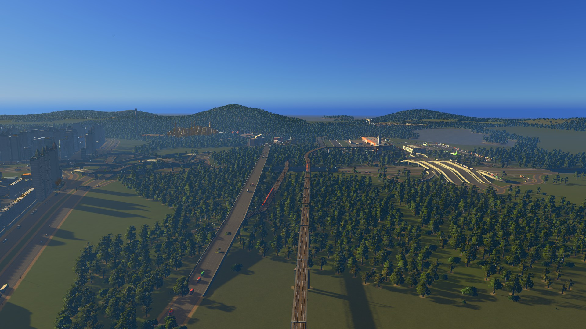
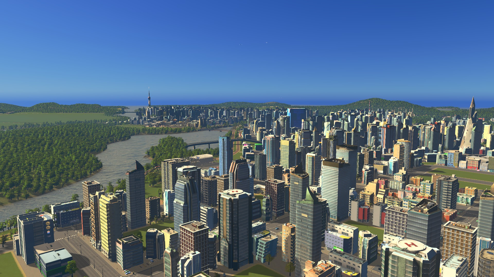
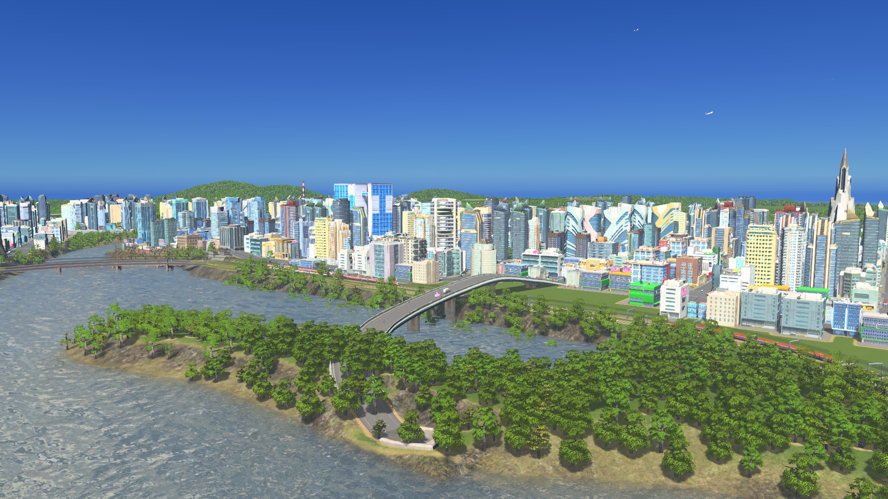
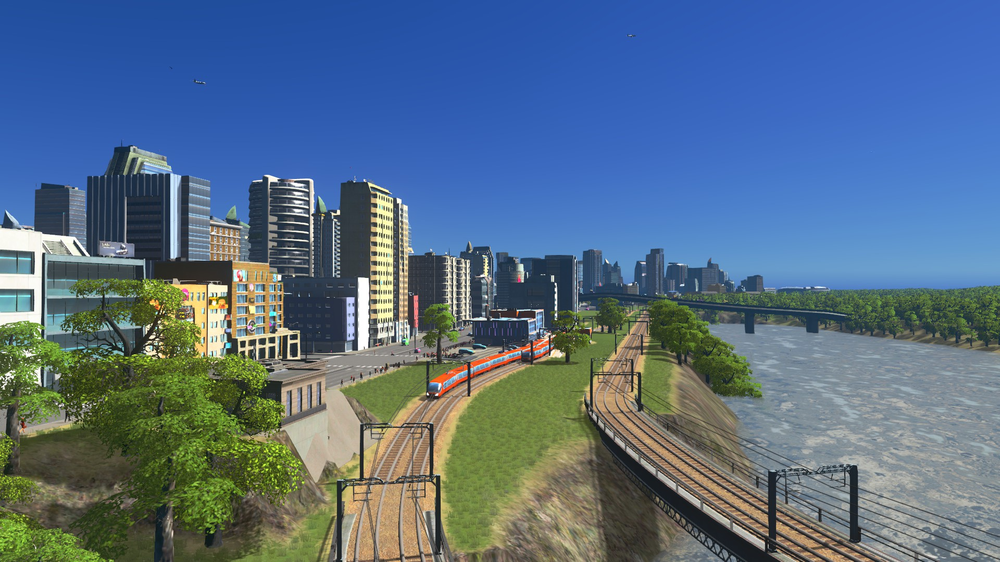
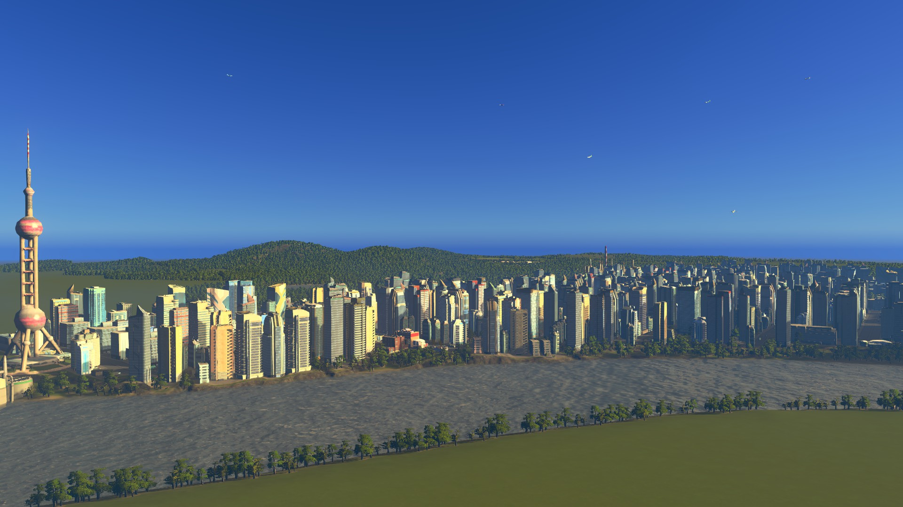

[notice]本文会按照时间记录江心市的城建历程。[/notice]
## 江心风景
[photos]

[/photos]

[photos]

[/photos]

[photos]

[/photos]

[photos]

[/photos]

简单介绍一下江心市。

北边是我市的处女地——同德区，同时也是我市的政治、交通中心。

同德区以南是我市的经济、旅游中心——明德区。

明德区以东的广大地区是我市的沿海经济区，目前正在开发中。现已建成机场枢纽区。

明德区以南是仍在开发的圭峰区。
