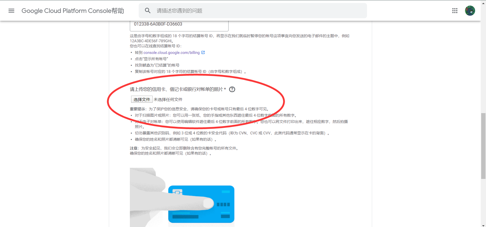

[notice]注意：本文具有时效性！[/notice]

薅羊毛也不容易啊...

# 先说结论

**“造不如买，买不如租”**

## 解释一下

**“造不如买”**意思是，我自己用自己的资料和信用卡注册，还不如拿虚拟信用卡来注册。

毕竟我们只是薅羊毛，万一你用得太猛，不小心出费用了，咋办？

我曾经听说，有位老哥用自己的信用卡注册 AWS，不小心出费用了。

其实，出费用也不要紧。

可这位老哥不小心就搞出了**几万美元**的费用😮，信用卡都透支了。

让我们换个角度，

如果你用自己的信用卡薅到了羊毛，

但有效期只有一年，那下一年你这个账号就废了...

 

**“买不如租”**意思是，我拿虚拟信用卡注册，不如买成品账号。

虽然，目前市面上有专供注册各种账号的虚拟信用卡，

但，你仍然需要自己注册。可自己注册是需一定技巧的（下文我会提到），

只要一点点细节搞不好，你的账号就可能被风控了...😔

即使你成功注册，之后还是有可能被要求提交各种资料（其实还是被风控了

而成品账号基本上就没有以上提到的顾虑，只要不故意搞事，基本上都是可以正常使用

# 目前各 IDC 的一些风控手段
## GCP
完成注册后，**大概率**会让你提供信用卡的照片，就像这样👇

如果你不是用自己的信用卡的话，基本无解。

或者，如果你 PS 技术高超，那也可以尝试在网上找图片自己修改一下。

[notice]小结：GCP的风控手段相比其他 IDC 来说，算是比较宽松的了，只要你能过“二验”，基本上问题不大[/notice]
## AWS
AWS 风控主要是分为**注册时**和**注册后**。
### 注册时：付款信息存在问题
错误提示：**错误: 您的付款信息存在问题**，就像这样👇

解决办法：按照提示，用英语发工单。

过程中可能会需要你提供各种资料，成功几率不大...
### 注册后：要求提交各种资料
注册后一段时间可能会收到 AWS 官方发来的邮件，下面是一个例子👇

解决办法：可以到网上找账单文档模板（必须是英文的），然后自行修改，一定要保证文档内的身份信息和你注册时提供的资料相符。

[notice]小结：目前来看，AWS的风控是最严的，而且有愈来愈严格的趋势。估计是前段时间被薅得太严重了...[/notice]

## 阿里云国际
阿里云国际注册比较困难，但也是有办法的，下面提供一种思路。

鉴于阿里云目前支持信用卡和 PayPal 验证，

如果信用卡验证不顺利的话，我们可以考虑 PayPal 验证。

下面说说大概步骤：

1. 注册一个 PayPal 账号  
**注意：PayPal 账号注册的区域最好与阿里云注册时选择的区域一致。注册时使用的手机号码最好与阿里云注册时使用的手机号码一致。**
2. 绑定 PayPal 账号
3. 成功（不一定...

## Azure
Azure 目前我没有尝试过使用信用卡注册，如果信用卡验证不顺利的话，可以考虑注册学生优惠（需要 EDU 邮箱）

# 最后：白嫖前的准备和一些需要注意的地方
[notice]以下全为本人的一己之见。[/notice]

 - 一个灵活的脑子
 - 一个梯子（最好是线路齐全一些的，有时候注册一些东西的时候可能需要特定地区的线路）
 - 一个虚拟电话卡（最好是 Google Voice）
 - 虚拟信用卡（这个最好是需要用的时候再注册/购买）
 - 善用 Google 和 Baidu
 - 注册的时候记得打开浏览器的**无痕模式**，或者清理一下 Cookies
 - 之前注册已经用过的邮箱和电话号码就不要再用了，避免风控。
 - 准备一套[外国人的资料](https://51.ruyo.net/%E8%99%9A%E6%8B%9F%E8%BA%AB%E4%BB%BD%E4%BF%A1%E7%94%A8%E5%8D%A1%E7%94%9F%E6%88%90/)，注册时个人资料和账单信息最好不要有出入