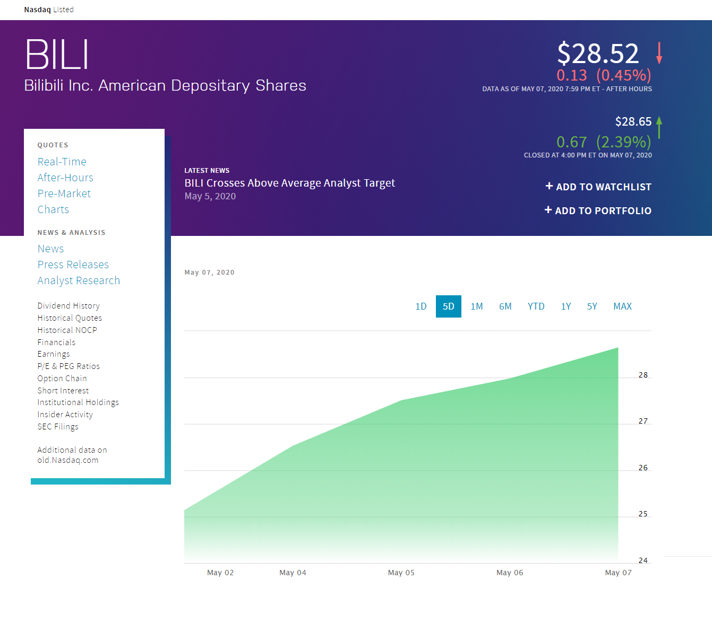

[notice]日记。不定期更新。[/notice]

# 2020 年
## 6 月 29 日

## 6 月 28 日
晚上考语文...

又没背书
## 6 月 27 日
我们不是学习机器，

我们是人！

机器也许不受公序良俗的约束，

可是人肯定是要受公序良俗的约束的！

纵使你成绩有多好也无用，

道德败，

则皆败！
## 6 月 26 日
最近有好多 idea 随口一说就忘了，觉得我得买支录音笔记录一下...
## 6 月 25 日
 > 端午节安康！

## 6 月 22 日
最近在想送给她什么礼物好呢？
## 6 月 21 日
今天是父亲节，还是二十四节气中的夏至，还看到了“错过一次等十年”的日环食，还拍了几张好看的照片。

What a nice day!
## 6 月 20 日
今天感冒了。

可能是血糖低和感冒引起的

头晕了一个早上

虽然后来靠蜜糖水活过来了

但还是好难受啊😖
## 6 月 19 日
有事发生...可惜不能写出来呢...
## 6 月 18 日
好似无事发生...
## 6 月 17 日
好似无事发生...
## 6 月 16 日
今天在本地电视台的科普节目中看到了以前的数学老师 —— 老黄，感觉他演技好浮夸啊......

------

上课时，如果你的同桌闭着眼、低着头，

请不要第一时间认为 TA 在打瞌睡，

也许 TA 只是在用脑电波和老师交流呢...

@hqn同学
## 6 月 15 日
最近听说又要班干部竞选。

看了一眼名单，只能说是“群魔乱舞”...

------

恕我直言，人都是自私的。

哪有人会为了投票给你，而不为自己投票呢？

别人又不是和你有什么“利益关系”，更不是你老爸老妈......

还是 too young too simple sometime naive!
## 6 月 13 日
好吧...

说好的复习，最后变成了一堆男人臭打游戏...

我倒是没有参与其中...

我可是一直在复习哦！

主要是因为我太菜了...
## 6 月 12 日
明天出去找 lwt 带帅逼复习！
## 6 月 11 日
这次期中考试考得挺差的......
## 6 月 10 日
cmf今天终于回来了！！！

------

这次数学刚好及格...

数学一生黑！！！
## 6 月 9 日
cmf不在的第二天：

我们班今天闯大祸了，不知道他老人家会不会气死......
## 6 月 8 日
这次生物考好差...

------

cmf（班主任）不在的第一天：今天是个好日子！！！
## 6 月 6 日
终于考完了！开心！

今天在万达和帅哥美女们玩了一天！高兴！
## 6 月 1 日
儿童节快乐！

------

考试周。

停更。
## 5 月 25 日
复习周。

停更。
## 5 月 24 日
考试前：这次考的内容好简单啊！这次稳了！

考试后：这™的绝对是来捣乱的！什么垃圾试卷！
## 5 月 22 日
今天晚上考了英语

啥都不说了，英语一生黑🌚
## 5 月 21 日
这个世界太疯狂

这个世界好复杂
## 5 月 20 日
[notice]今天没收到礼物...看来我就是万年寡王...[/notice]

今天是lwt大帅哥的生日！！！

------

还是没忍住给她也写了一张明信片...

-------

我妈用¥52的红包，换回了我爸¥520的红包！

我枯了！

我爸还特意买了花！

我🍋了！

## 5 月 19 日
 > All things will be fine.

## 5 月 18 日
心情复杂...

五味杂陈...

有些事情是得好好思考下了...
## 5 月 17 日
 > 黑云压山，大雨倾盆。

## 5 月 15 日
 > 人生就像一场马拉松，你以为跑到了“终点”，实际上后面还有无数个“终点”在等着你。 

其实这句话是当时随口说的。

感觉有点毒鸡汤那味了。
## 5 月 14 日
 > 你我本无缘。

算了，看开点吧。
## 5 月 13 日
要好好控制情绪。
## 5 月 12 日
下午突然取消“摸底考试”。
太快了，太快了，早上还在复习，下午就取消了😂
## 5 月 11 日
详见 [日记 | 2020年5月11日](https://blog.cattom.space/archives/daily-20200511/)
## 5 月 10 日
今天是母亲节。

我也不知道写什么好（我属于不太擅长表达感情的人

写了一些想对她说的心里话，希望她能看完，并且好好思考下吧...
## 5 月 7 日
小米的公关部门是不是应该得出来鞠躬谢罪了...
## 5 月 6 日
入坑了公主焊接😆

我就体验一下，绝对不氪金（
## 5 月 5 日
假期

稍纵即逝...

突然想起来老博客还有好多文章没有搬回来呢...
## 5 月 4 日
今天是五四青年节。

------

奔涌吧，股价！

------

今天晚上2个小时跑了3个商圈，累死我了
## 5 月 3 日
《后浪》本质是商业宣传片吧...
## 5 月 2 日
一头扎进作业堆里...

久久不能自拔
## 5 月 1 日
今天是五一劳动节。

不要忘记这个节日是工人们用血与泪换来的！
## 4 月 30 日
Nothing.
## 4 月 29 日
这个星期三有点奇怪

作业居然一点也不多
## 4 月 28 日
早上起来发路由器没法拨号

后来看到光猫在闪红灯

可能是光纤出来问题

被迫拿出尘封已久的 4G 路由器😂

------

晚上检查了一下

发现是楼梯间的接线箱里的光纤线被老鼠咬断了🌚
## 4 月 27 日
今天早上起床晚了

8点多才醒

整天的节奏都被打乱了...
## 4 月 26 日
最近的瓜好多啊

都快吃不过来了
## 4 月 25 日
潜水了几天

利用 RSSHub + TTRSS 弄了个 [RSS 聚合](https://reader.cattom.space/)

自动收集来自知乎、B站、观察者网的资讯

以后有空写个教程

累死我了🌚
## 4 月 24 日
> “正确的结果，是从大量错误中得出来的。”
> 
> —— 钱学森

今天是中国航天日。
## 4 月 23 日
活久见！

GitHub 故障了🌚🌚🌚
## 4 月 22 日
今天降温了，还下大雨，连着下几个小时都不带喘气的

想起昨天还是穿短袖呢

今天就是卫衣＋外套了

昨天晚上睡觉前忘记关窗了

结果今天早上被冷醒了🌚

广东的气温变化真的是令人摸不着头脑
## 4 月 21 日
今天穿了短袖出门

现在有点后悔

广door的蚊子真的好多啊啊啊

我现在左手手臂已经被咬肿了😭
## 4 月 20 日
### 无话可说
做卷的时候不小心把浏览器关了...

最后不够时间做了...

无话可说

晚上补测了，成绩还不错
### 一 次 就 过
今天考了政治，92，一次就过了。

不错！
## 4 月 19 日
我好菜啊...（当然有人比我更菜

## 4 月 18 日
发现好久没玩 Cities:Skylines...

Watch Dog 也好几天没玩了...

做作业做到头都快秃了
## 4 月 17 日
好多作业啊啊啊！

不想做啊啊啊！
## 4 月 16 日
### 愤怒
在巨头企业垄断市场的背景下

可以预见的是，个人开发者与垄断企业之间的斗争将会一直持续下去

希望百度积点德吧

### 新机子
今天搞了一台阿里云国际的ECS，香港区，配置是1C、1G、1M(Mbps)，用来做网站绰绰有余了。

而且价格挺优惠的，只需要60元/年（我是找代购的
## 4 月 15 日
早上：今天搞了张虚拟卡，准备去薅羊毛😏

晚上：翻车了🌚

我就脱圈几个月，风控就变严了...

算了算了，不说了，都是辛酸泪😭
## 4 月 14 日
Azure 的客服小姐姐真的是好有耐心👍

虽然开不到香港区的机子

但还是很感谢！
## 4 月 13 日
👍

## 4 月 12 日
### 运气？！
周日晚上考了语文，难度有点大，成绩自然是惨不忍睹的。

考试结束后，到处问了一下成绩，大多成绩都不太好。

这时，lwt出现了！

我们当时都很怀疑，怎么可能蒙对 10 道选择题，
然后他接着说...

### 运气！！
后来，我提议lwt去买彩票。

以下是对话原文（大概）：
 > lwj：你这个“蒙”，比看书本查答案还要准确啊...
 >
 > 我建议你今晚别洗手了，赶紧去买张彩票吧，搞不好就中大奖了...
 >
 > lwt：你还别说，我刚刚去剪头发，和我老爸顺便买了一张

然后，他还真的中奖了！便有了以下这一幕...

## 4 月 11 日
最近在白嫖 Azure，到时候可能会出教程。

和 Azure 的客服小姐姐打交道好困难啊！！！

## 4 月 10 日
### 奇 思 妙 想
昨天晚上睡觉前，想到博客都迁移到了 Github Pages 上，不如将部署在阿里云香港的其他网站也迁移到过来吧。

这样子做的话，好处有：
 - 减轻阿里云香港的负担（毕竟它只是一个1C1G的小鸡啊）
 - 充分利用 Git 的版本控制特性

但是早上起来，我突然间想起来 GitHub Pages 只支持静态网页...

然后我检查了一下我的部署架构图，
发现只有 [Start](https://start.cattom.space/)、[Navigation](https://cattom.space/)、[Music](https://music.cattom.space/) 三个网站是静态网站，于是便一口气将他们全部丢上 GitHub 上了。

丢上去之后都做了自定义域，但到启动 HTTPS 之后，
访问的时候 Chrome 提示我证书错误？！

然后，GitHub 提示我 DNS 解析失败...

然后我用 `dig` 检查了一下，发现解析正常。

然后过了一阵子之后，就恢复正常了...

## 4 月 8 日
最近看到[熊猫小A](https://blog.imalan.cn/)大佬的[完全使用 GitHub 写博客](https://blog.imalan.cn/archives/blog-with-github/)，而且还有范例仓库，便 fork 下来尝试一下。

这个博客目前是利用 GitHub Pages 托管静态网页，GitHub Action 自动构建、发布文章。

MarkDown 还是很有意思的。

以后可能会考虑将[原博客](https://cattom.site)里的文章搬移到这里。
