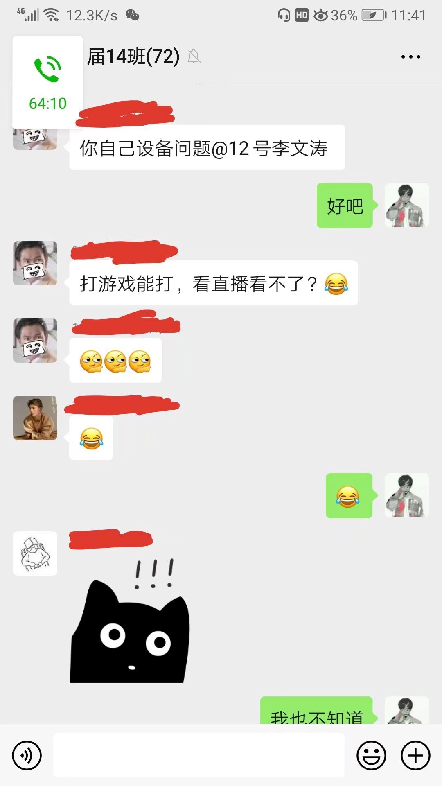

# Day 0

## 失败的班会

# Day 1 ：作业、讨论与“小小签到”

第一天都是一些线下作业，并没有真正意义的“网课”。

这一天有两次“线上讨论”，其实就是提出问题，老师解答。

可是我们班的同学太积极，直接帮老师回答问题，给老师省了不少力气。

## “小小签到”是个啥？

顾名思义，就是个签到小程序。
但为了响应当前“停课不停学”的要求，增添了许多便于教学的内容，学生可以在这上传作业，老师可以检查作业。

就是广告有点多，还好不影响使用…

# Day 2

## 地理老师咕咕咕…

## 微信不改名 明天请出群

[photos]

[/photos]

# Day 3

# Day 4

## 评讲？！

最近每天晚上都有直播答疑时间，可老师讲的题目，我都没错（那些题目还贼简单

## 祖安班主任

[photos]

[/photos]

应该是史上最“嚣张”的班主任了吧…

# Day 5

## 论如何调动学生的求知欲

# Day 6

## 数学老师的认可

## 三个男人一台戏

## 班长の愤怒

# Day 7

## 我们是如何直播的？

目前我们学校采用**企业微信**进行直播。并不是现时相对主流的钉钉和学习通。

每当老师欲要上课之时，老师启动直播，并将链接分享至班群。学生只需点击链接，即可学习。（怎么有点像广告

## 优 ＆ 劣

### 优点

#### ①稳定

相比于钉钉与学习通，企业微信的稳定性高，基本上不存在无法访问的情况。（不知道比~~学习堵~~学习通高到哪里去了）断流基本没有，延时目测5s以内。

#### ②真·直播

企业微信的直播没有太多花里胡哨的功能。老师只能讲课，并不能查看学生的画面，也无法打开学生的摄像头，甚至连考勤都变得有些困难。

### 缺点：缺少互动

其实这并不是企业微信一家的缺点。线上教学的确比面对面教学更难互动。

但在企业微信，学生只能通过留言区向老师提问。连点赞的地方都没有，唉…

### 1 vs 280

其实也与学校有关。

以地理为例，每个地理老师负责5个班的教学任务，每班大概有学生56人。那么如果假设某次直播学生全部按时进入，那么直播间中将有**280人**！

别说互动了，如果直播间中每个学生发一句话，也能把老师弄得够呛。所以老师们索性让学生们“闭嘴”，自己在屏幕前讲自己的课。

缺少了线下学习时的气氛，学生是否还能认真地听老师们的“单口相声”，这就很难说了…
