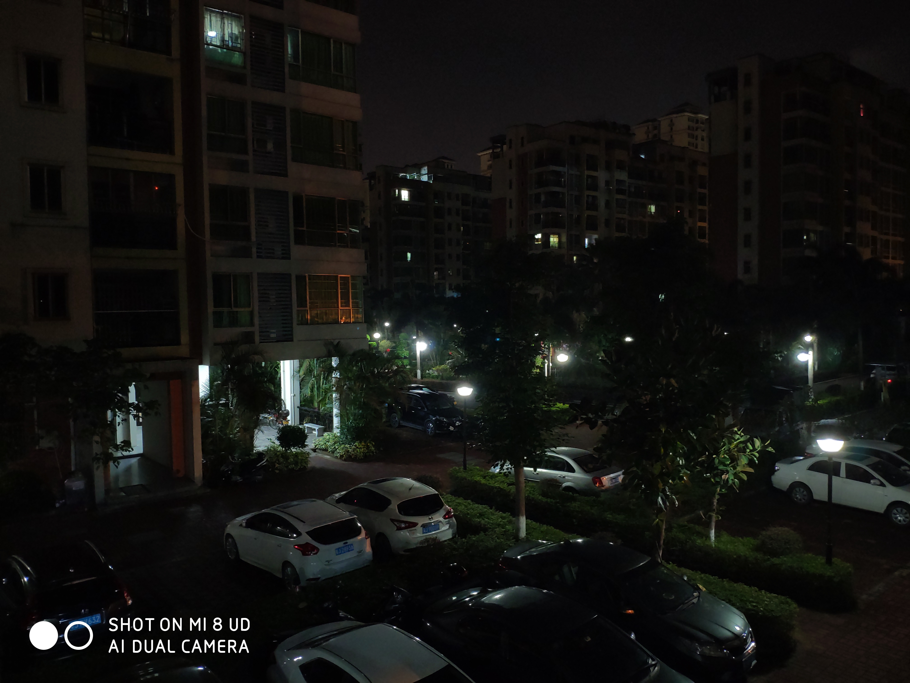

最近在家里太无聊了，折腾了一下相机的“专业模式”。

[notice]本人是摄影小白，拍得不好还请各位大佬见谅。[/notice]

先看照片👇

[photos]

[/photos]

以上两张照片 ISO 均为`1600`，快门时间分别为`1秒`和`2秒`。

这两张是在晚上8点钟拍的。我个人感觉第一张亮了一点，但也不是不能接受。

之后，我把照片放到了空间上，大都认为第二张快门时间太长，过曝。

[notice]简单总结：相机的曝光程度取决于 ISO 和曝光时间。[/notice]

------

昨天凌晨，我又随便拍了几张，先看照片👇

[photos]

[/photos]

上面两张照片 ISO 分别是`1600`和`800`，快门时间均为`1/2`秒。

这两张照片中，我更偏爱第一张，暗处更加清晰；但第二张更符合现实情况。

[notice]简单总结：ISO 和曝光时间要取得一个平衡，才能拍到好看的照片😏[/notice]

上面这张照片 ISO 是`400`，快门时间是`1秒`。

这张照片个人感觉是比较好的一张，暗部更加清晰，亮部也没有过曝。

到此结束。下次再来试试 Snapseed
